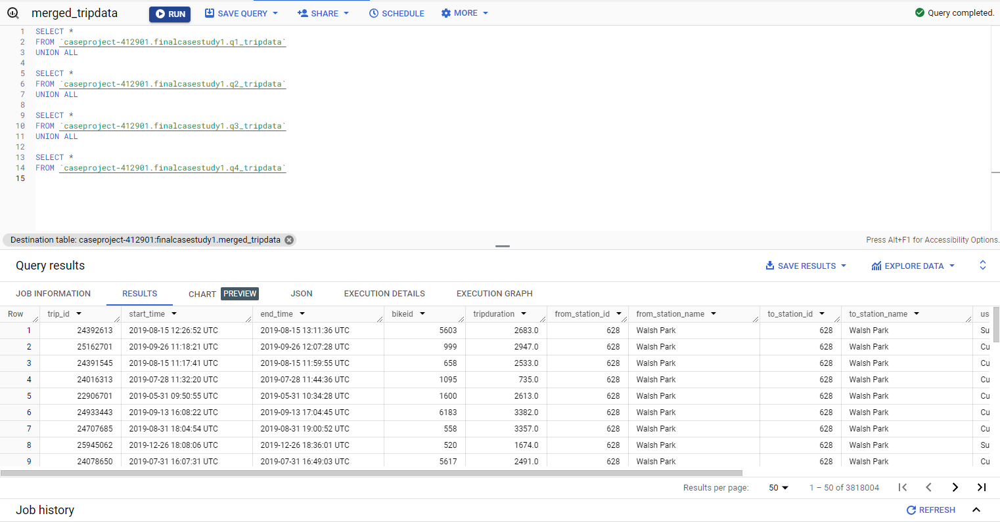
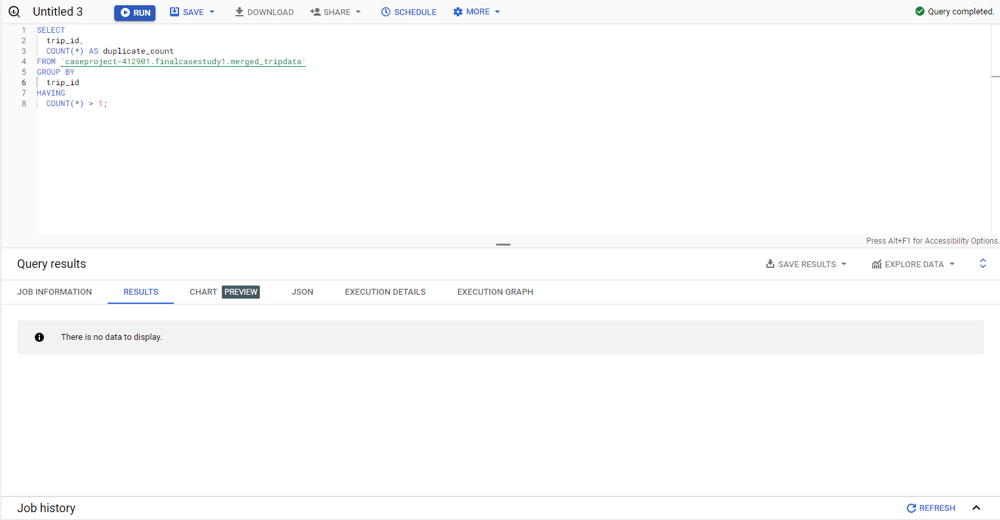
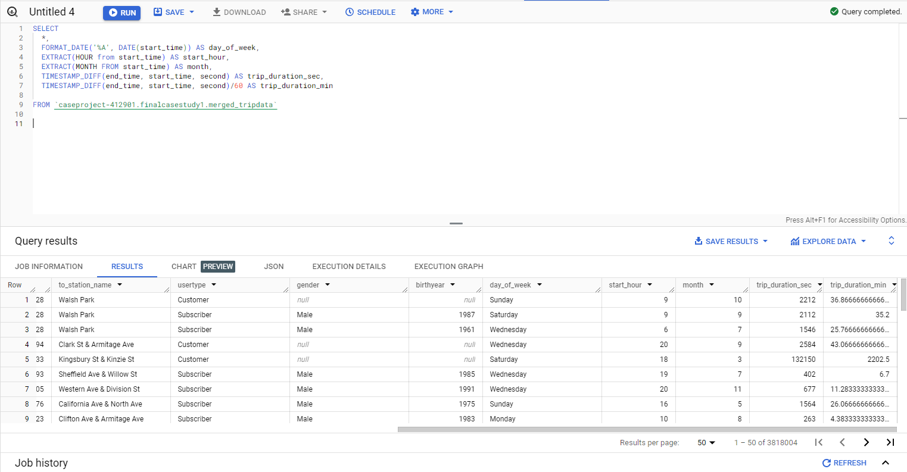

# Project 1: Unlocking Insights: A Journey through Data with SQL and Tableau (Google Capstone Project)

Introduction:
Welcome to my Cyclistic bike-share analysis project—a testament to my growth as a data analyst. I dived into Cyclistic's data to uncover key insights driving its marketing strategies.

Scenario:
Join me on a journey into Cyclistic's world, where data-driven decisions fuel innovation. As part of the Marketing Analytics Team, I explored user behavior to inform targeted marketing efforts.

About the Company:
Cyclistic, a Chicago bike-share company, caught my attention with its inclusive approach. With a vast fleet and a focus on profitability, Cyclistic sought to convert casual riders into loyal members through strategic marketing.

Ask:
This project aimed to answer three key questions:

How do casual riders and annual members differ in bike usage?
What drives casual riders to become annual members?
How can digital media aid in this conversion?
Join me as I showcase the insights gained and my analytical skills honed through this project.

The first thing I did was I merged the data of all tables using UNION ALL. All the data and columns were the same so this went smoothly.

I made sure that the merged data didn't have any duplicates using COUNT.

I made the new colums, "day_of_week, start_hour, month, trip_duration_min, and trip_duration_sec." These were made to make my analysis easier. 

I then exported the table to a CSV file and uploaded the file to Tableau 

Find my live dashboard here
<https://public.tableau.com/app/profile/cesar.v4729/viz/dashboard1_17068484244590/Dashboard1>

Conclusion: Subscribers contribute to a higher total number of rides, indicating that they are more consistent users of the bike rental service.
Casual riders, on the other hand, contribute significantly to the total ride time, suggesting that while they may not ride as frequently, they tend to have longer individual rides. 
The highest amount of trips occur during the months of June, July, August, and September, indicating that the warmer weathers attract more users. 

1. Consider creating targeted marketing campaigns that highlight the benefits of membership for longer rides, such as discounted rates for extended durations.
Emphasize the convenience and cost-effectiveness of a subscription for those who ride frequently, potentially incorporating loyalty programs or exclusive perks for subscribers.
2. There is a peak in riders in the warm months and on weekends. Consider having a summer or weekend subscription. 
3. Consider offering promotions or trial periods for casual riders to experience the benefits of a subscription without a long-term commitment. This could encourage them to become regular subscribers.

# Project 2: Data Scraping with Python
In this project, I utilized Python libraries like BeautifulSoup, Requests, Pandas, and Matplotlib to scrape and analyze data from Wikipedia. I focused on extracting information about top international men's football goal scorers by country. Leveraging Jupyter Notebook, I efficiently employed web scraping techniques. Using BeautifulSoup for HTML parsing, Requests for fetching web pages, and Pandas for data manipulation, I organized the extracted information. Matplotlib aided in creating insightful visualizations directly within the notebook.

[Click here to see code and visualizations Jupyter Notebook](project2final.md)

