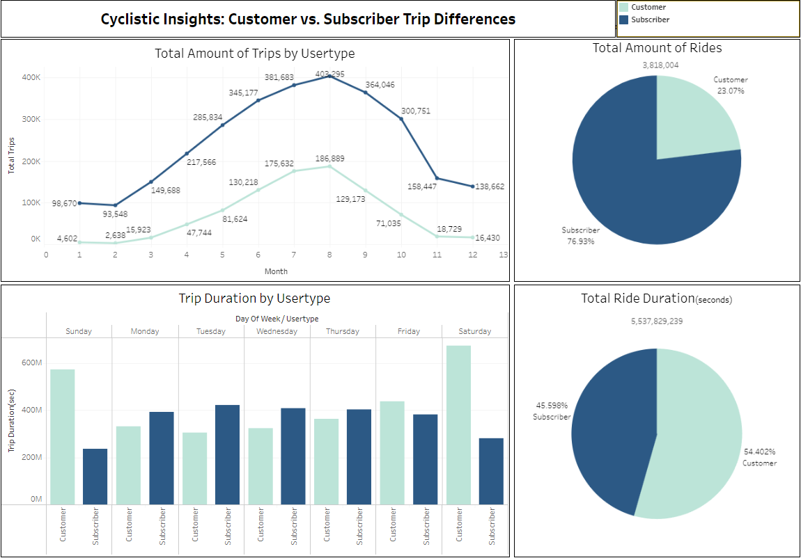

## Portfolio

# Project 1: How to convert casual riders to subscription based members.(Google Capstone Project)

Introduction:
Welcome to my Cyclistic bike-share analysis project—a testament to my growth as a data analyst. I dived into Cyclistic's data to uncover key insights driving its marketing strategies.

Scenario:
Join me on a journey into Cyclistic's world, where data-driven decisions fuel innovation. As part of the Marketing Analytics Team, I explored user behavior to inform targeted marketing efforts.

About the Company:
Cyclistic, a Chicago bike-share company, caught my attention with its inclusive approach. With a vast fleet and a focus on profitability, Cyclistic sought to convert casual riders into loyal members through strategic marketing.

Ask:
This project aimed to answer three key questions:

How do casual riders and annual members differ in bike usage?
What drives casual riders to become annual members?
How can digital media aid in this conversion?
Join me as I showcase the insights gained and my analytical skills honed through this project.

The first thing I did was I merged the data of all tables using UNION ALL. All the data and columns were the same so this went smoothly.

Too make sure there were no errors I made sure there were no duplicates in my joined table using COUNT. 

I then made more columns because I needed more columns to make an analysis.

I then exported the table to cvs and uploaded the file to Tableau 

Check here for my finished working dashboard.
[https://public.tableau.com/app/profile/cesar.v4729/viz/dashboard1_17068484244590/Dashboard1]

Conclusion: Subscribers contribute to a higher total number of rides, indicating that they are more consistent users of the bike rental service.
Casual riders, on the other hand, contribute significantly to the total ride time, suggesting that while they may not ride as frequently, they tend to have longer individual rides. 
The highest amount of trips occur during the months of June, July, August, and September, indicating that the warmer weathers attract more users. 

Marketing: Consider creating targeted marketing campaigns that highlight the benefits of membership for longer rides, such as discounted rates for extended durations.
Emphasize the convenience and cost-effectiveness of a subscription for those who ride frequently, potentially incorporating loyalty programs or exclusive perks for subscribers.
