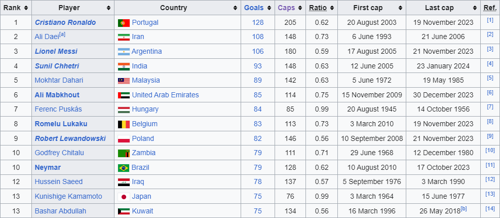
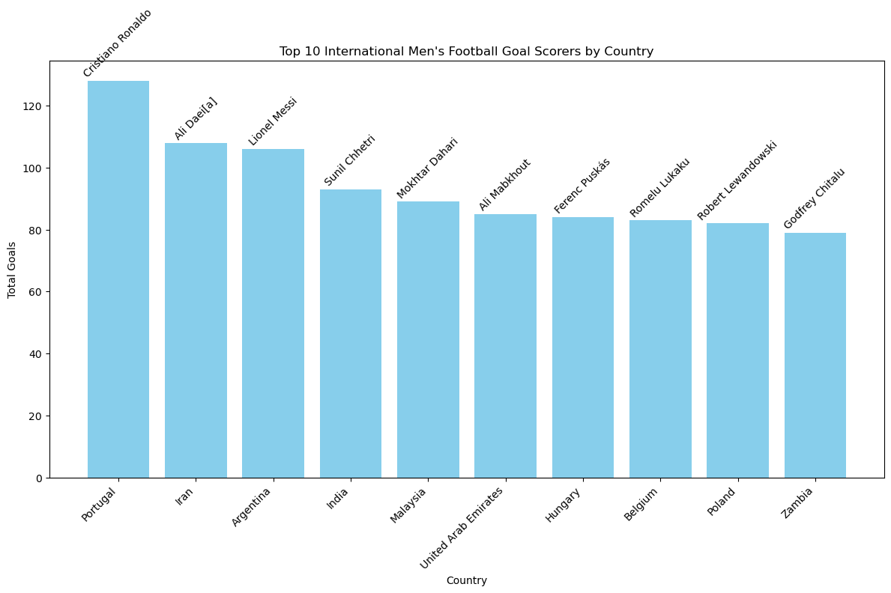
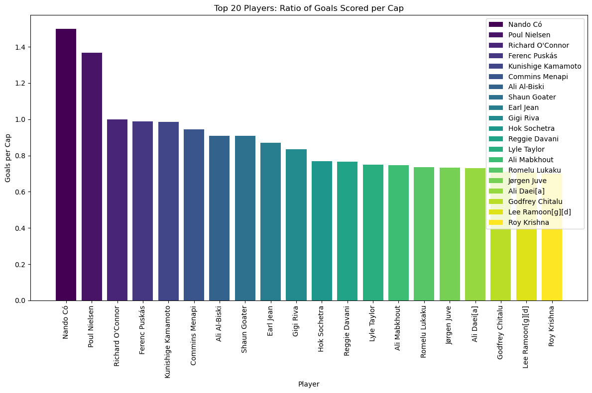
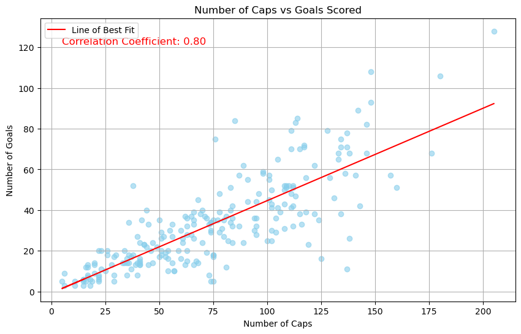
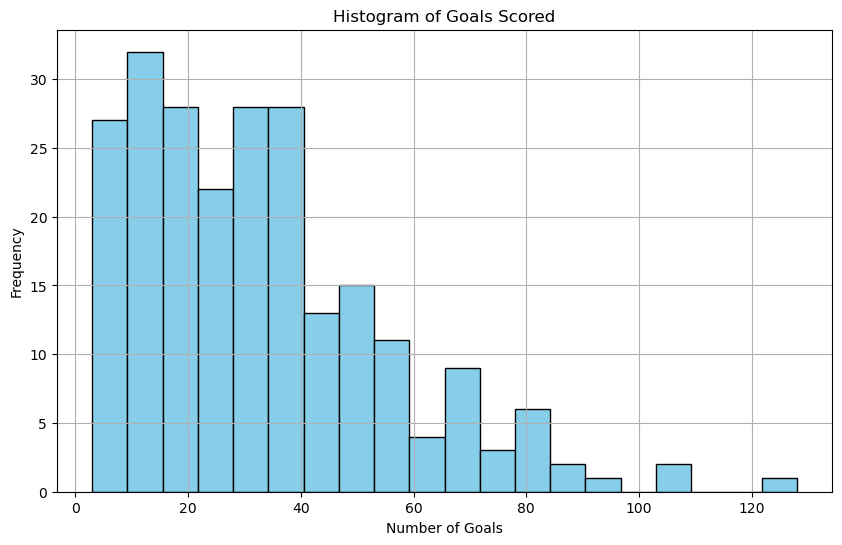

<div style="text-align: center;">
    <h1>Data Scraping with Python</h1>
</div>

#### In this Python data scraping project, I leverage BeautifulSoup and requests to extract information from web pages efficiently. Through hands-on examples, I explore techniques to gather and analyze data from websites and create useful vizualizations.

#### I chose to scrape the table titled 'List of top international men's football goal scorers by country' from Wikipedia.




#### Aquire the table from the wikipedia page and read it into a DataFrame


```python
import requests
from bs4 import BeautifulSoup
import pandas as pd

# URL of the Wikipedia page
url = "https://en.wikipedia.org/wiki/List_of_top_international_men%27s_football_goal_scorers_by_country"

# Send a GET request to fetch the HTML content of the page
response = requests.get(url)
html_content = response.text

# Parse the HTML content using BeautifulSoup
soup = BeautifulSoup(html_content, "html.parser")

# Find the first table on the page
table = soup.find("table", class_="wikitable")

# Read the table into a DataFrame using Pandas
df = pd.read_html(str(table))[0]

# Write the DataFrame to a CSV file
#df.to_csv("football_goal_scorers2.csv", index=False)

```

#### Check the table to make sure it is correct


```python
display(df)
```


<div>
<style scoped>
    .dataframe tbody tr th:only-of-type {
        vertical-align: middle;
    }

    .dataframe tbody tr th {
        vertical-align: top;
    }

    .dataframe thead th {
        text-align: right;
    }
</style>
<table border="1" class="dataframe">
  <thead>
    <tr style="text-align: right;">
      <th></th>
      <th>Rank</th>
      <th>Player</th>
      <th>Country</th>
      <th>Goals</th>
      <th>Caps</th>
      <th>Ratio</th>
      <th>First cap</th>
      <th>Last cap</th>
      <th>Ref.</th>
    </tr>
  </thead>
  <tbody>
    <tr>
      <th>0</th>
      <td>1</td>
      <td>Cristiano Ronaldo</td>
      <td>Portugal</td>
      <td>128</td>
      <td>205</td>
      <td>0.62</td>
      <td>20 August 2003</td>
      <td>19 November 2023</td>
      <td>[1]</td>
    </tr>
    <tr>
      <th>1</th>
      <td>2</td>
      <td>Ali Daei[a]</td>
      <td>Iran</td>
      <td>108</td>
      <td>148</td>
      <td>0.73</td>
      <td>6 June 1993</td>
      <td>21 June 2006</td>
      <td>[2]</td>
    </tr>
    <tr>
      <th>2</th>
      <td>3</td>
      <td>Lionel Messi</td>
      <td>Argentina</td>
      <td>106</td>
      <td>180</td>
      <td>0.59</td>
      <td>17 August 2005</td>
      <td>21 November 2023</td>
      <td>[3]</td>
    </tr>
    <tr>
      <th>3</th>
      <td>4</td>
      <td>Sunil Chhetri</td>
      <td>India</td>
      <td>93</td>
      <td>148</td>
      <td>0.63</td>
      <td>12 June 2005</td>
      <td>23 January 2024</td>
      <td>[4]</td>
    </tr>
    <tr>
      <th>4</th>
      <td>5</td>
      <td>Mokhtar Dahari</td>
      <td>Malaysia</td>
      <td>89</td>
      <td>142</td>
      <td>0.63</td>
      <td>5 June 1972</td>
      <td>19 May 1985</td>
      <td>[5]</td>
    </tr>
    <tr>
      <th>...</th>
      <td>...</td>
      <td>...</td>
      <td>...</td>
      <td>...</td>
      <td>...</td>
      <td>...</td>
      <td>...</td>
      <td>...</td>
      <td>...</td>
    </tr>
    <tr>
      <th>227</th>
      <td>205</td>
      <td>Liam Walker [i]</td>
      <td>Gibraltar</td>
      <td>5</td>
      <td>75</td>
      <td>0.07</td>
      <td>19 November 2013</td>
      <td>21 November 2023</td>
      <td>[223]</td>
    </tr>
    <tr>
      <th>228</th>
      <td>209</td>
      <td>Abdullahi Sheikh Mohamed</td>
      <td>Somalia</td>
      <td>3</td>
      <td>6</td>
      <td>0.50</td>
      <td>19 April 2000</td>
      <td>29 November 2005</td>
      <td>[224]</td>
    </tr>
    <tr>
      <th>229</th>
      <td>209</td>
      <td>Jamie Browne</td>
      <td>U.S. Virgin Islands</td>
      <td>3</td>
      <td>11</td>
      <td>0.27</td>
      <td>27 September 2006</td>
      <td>14 June 2022</td>
      <td>[225]</td>
    </tr>
    <tr>
      <th>230</th>
      <td>209</td>
      <td>J. C. Mack</td>
      <td>U.S. Virgin Islands</td>
      <td>3</td>
      <td>18</td>
      <td>0.17</td>
      <td>9 September 2018</td>
      <td>16 November 2023</td>
      <td>[226]</td>
    </tr>
    <tr>
      <th>231</th>
      <td>209</td>
      <td>Ramin Ott</td>
      <td>American Samoa</td>
      <td>3</td>
      <td>15</td>
      <td>0.20</td>
      <td>10 May 2004</td>
      <td>4 September 2015</td>
      <td>[227]</td>
    </tr>
  </tbody>
</table>
<p>232 rows × 9 columns</p>
</div>


####  Import libraries for vizualizations and analysis


```python
import matplotlib.pyplot as plt
import numpy as np
from scipy.stats import linregress
import seaborn as sns
```

#### Many different graphs to vizualize data and to see correlations


```python
# Select top 10 countries and their corresponding players
top_countries = df.head(10)

# Plot a bar chart of top goal scorers by country
plt.figure(figsize=(12, 8))
bars = plt.bar(top_countries["Country"], top_countries["Goals"], color="skyblue")

# Annotate each bar with player names
for bar, player in zip(bars, top_countries["Player"]):
    plt.text(bar.get_x() + bar.get_width() / 2, bar.get_height() + 0.5, player,
             ha='center', va='bottom', rotation=45)

plt.xlabel("Country")
plt.ylabel("Total Goals")
plt.title("Top 10 International Men's Football Goal Scorers by Country")
plt.xticks(rotation=45, ha="right")
plt.tight_layout()
plt.show()
```


    

    


```python
# Calculate the ratio of goals scored per cap
df['Ratio'] = df['Goals'] / df['Caps']

# Sort the DataFrame based on the 'Ratio' column in descending order
df_sorted = df.sort_values(by='Ratio', ascending=False)

# Select only the top 20 players
top_20_players = df_sorted.head(20)

# Define colors for the bars
num_colors = len(top_20_players)
colors = plt.cm.viridis(np.linspace(0, 1, num_colors))  # Use viridis colormap

# Plot a bar chart of ratio for the top 20 players with different colors for each bar
plt.figure(figsize=(12, 8))
bars = plt.bar(top_20_players['Player'], top_20_players['Ratio'], color=colors)

# Add labels and title
plt.xlabel('Player')
plt.ylabel('Goals per Cap')
plt.title('Top 20 Players: Ratio of Goals Scored per Cap')

# Rotate x-axis labels for better readability
plt.xticks(rotation=90)

# Show color legend
plt.legend(bars, top_20_players['Player'], loc='upper right')

plt.tight_layout()
plt.show()
```


    

    


```python
# Plot a scatter plot of Caps vs Goals
plt.figure(figsize=(10, 6))
plt.scatter(df['Caps'], df['Goals'], color='skyblue', alpha=0.6)
plt.title("Number of Caps vs Goals Scored")
plt.xlabel("Number of Caps")
plt.ylabel("Number of Goals")
plt.grid(True)

# Calculate the correlation coefficient
slope, intercept, r_value, p_value, std_err = linregress(df['Caps'], df['Goals'])

# Plot the line of best fit
plt.plot(df['Caps'], slope * df['Caps'] + intercept, color='red', label='Line of Best Fit')

# Add correlation coefficient to the plot
plt.text(df['Caps'].min(), df['Goals'].max() * 0.95, f'Correlation Coefficient: {r_value:.2f}', fontsize=12, color='red')

plt.legend()
plt.show()
```


    

    


```python
# Plot a histogram of goals scored
plt.figure(figsize=(10, 6))
plt.hist(df['Goals'], bins=20, color='skyblue', edgecolor='black')
plt.title("Histogram of Goals Scored")
plt.xlabel("Number of Goals")
plt.ylabel("Frequency")
plt.grid(True)
plt.show()
```


    

    

